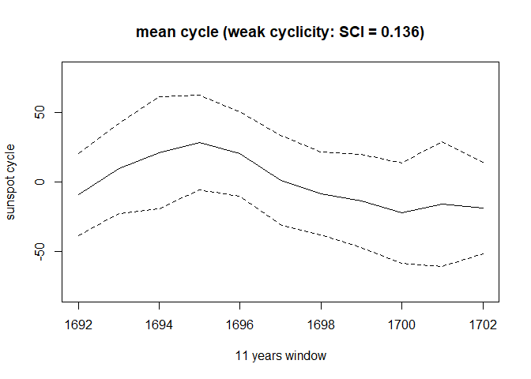

<!-- README.md is generated from README.Rmd. Please edit that file -->

# ctbi

<!-- badges: start -->
<!-- badges: end -->

The goal of ctbi is to clean, decompose, impute and aggregate univariate
time series. Ctbi stands for “Cyclic/trend decomposition using bin
interpolation” : the time series is divided into a sequence of
non-overlapping bins. The long-term trend is a linear interpolation of
the mean values between successive bins and the cyclic component is the
mean stack of detrended data within all bins. Outliers present in the
residuals are flagged using an enhanced Boxplot rule called LogBox,
which replaces the original 1.5 constant with *k* × log (*n*) + 1. The
strength of the cyclic pattern within each bin is quantified by a new
metric, the Stacked Cycles Index (SCI), with SCI &lt;= 0 associated with
no cyclicity and SCI = 1 a perfectly cyclic signal.

## Installation

You can install the development version of ctbi from
[GitHub](https://github.com/) with:

``` r
# install.packages("devtools")
devtools::install_github("fritte2/ctbi")
```

## Example

``` r
library(ctbi)
library(data.table)
# example of sunspot data
example1 <- data.frame(year = 1700:1988,sunspot = as.numeric(sunspot.year))
example1[sample(1:289,30),'sunspot'] <- NA
example1[c(5,30,50),'sunspot'] <- c(-50,300,400)
example1 <- example1[-(100:200),]
bin.period <- 11 # aggregation performed every 11 years (the year is numeric here)
bin.side <- 1989 # to capture the last year, 1988, in a complete bin
bin.FUN <- 'mean'
bin.max.f.NA <- 0.2
ylim <- c(0,Inf)
#'
list.main <- ctbi(example1,bin.period=bin.period,
                       bin.side=bin.side,bin.FUN=bin.FUN,
                       ylim=ylim,bin.max.f.NA=bin.max.f.NA)
data0.example1 <- list.main$data0 # cleaned raw dataset
data1.example1 <- list.main$data1 # aggregated dataset.
SCI.example1 <- list.main$SCI # this data set shows a moderate seasonality
mean.cycle.example1 <- list.main$mean.cycle # this data set shows a moderate seasonality
bin.size.example1 <- list.main$bin.size # 12 data points per bin on average (12 months per year)
#'
plot(mean.cycle.example1[,'generic.time.bin1'],
     mean.cycle.example1[,'mean'],type='l',ylim=c(-80,80),ylab='sunspot cycle',xlab='11 years window')
lines(mean.cycle.example1[,'generic.time.bin1'],
      mean.cycle.example1[,'mean']+mean.cycle.example1[,'sd'],type='l',lty=2)
lines(mean.cycle.example1[,'generic.time.bin1'],
      mean.cycle.example1[,'mean']-mean.cycle.example1[,'sd'],type='l',lty=2)
title(paste0('mean cycle (weak cyclicity: SCI = ',SCI.example1,')'))
```



``` r
# ctbi.plot(list.main,show.n.bin=10) # uncomment to see the plot of the time series
```
